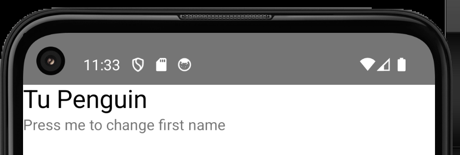
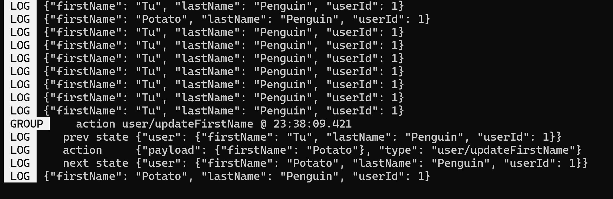

# React Native Cli
## Tutorial
https://www.udemy.com/course/react-native-mobile-app-development/

## Common errors
<div style="color: orange;">⚠️Cmd only, not powershell</div>

<div style="color: orange; ">⚠️If error https://stackoverflow.com/questions/78384724/react-native-error-java-io-uncheckedioexception-could-not-move-temporary-work -> use gradle 8.5 instead of 8.6 in <i>AwesomeProject\android\gradle\wrapper\gradle-wrapper.properties</i> </div>

<div style="color: orange; ">⚠️If syntax error in .js "Parsing error: No Babel config file detected for", in .eslintrc.js, add: </div>

```jsx
  plugins: [
    "babel", // fix error "Parsing error: Unexpected token"
    "html",
  ]
``` 


## Setup
https://www.youtube.com/watch?v=gH3l2DSlXDE
https://reactnative.dev/docs/environment-setup


## First Launch


(!) Cmd only, not powershell

## What is JSX?
```jsx
import {View, Text} from 'react-native';

function App() {
  // return React.createElement(
  //   View,
  //   null,
  //   React.createElement(Text, null, 'Hello World')
  // ); //without JSX -> complicated unpractical archi
  return ( //with JSX
    <View>
      <Text>Hello World</Text>
    </View>
  );
}
```

## Hello World App
```npx react-native init HWAPP```
```cd HWAPP && npx react-native run-android```

SafeAreaView ensures that the content is displayed within the safe area boundaries of a device. 

## React Hooks
- useState: same old `var1,setVar1 = useState(initVal)`
Some new stuff that i havent noticed before
- If useEffect on a variable var1:
  - If setVar1(newVal) is called, but newVal == var1, then useEffect will not be called 
  - At init, useEffect will be called too since var1 is initialized, which makes sense that [] is called at init even with empty dependency

- Does have useRef like Vue.js too

- useContext omgg like a globally accessible variable without passing props to 999 child of child of child components 

## Basic Components
- Image https://reactnative.dev/docs/image
```jsx
      <Image
        source={imageSource}
        style={{width: '100%', height: '100%', backgroundColor: 'red'}}
        resizeMode={'center'} // Also: 'cover', 'contain', 'stretch', 'repeat'
        // If there is an error loading the image, log an error message and set the image source to a local image
        onError={() => {
          console.log('Error has been detected while loading an image');
          setImageSource(require('./assets/images/cake.png'));
        }}
      />
```

-  TextInput https://reactnative.dev/docs/textinput
```jsx
  const [email, setEmail] = useState('');
  return (
      <TextInput
        style={{borderWidth: 1, padding: 10, borderRadius: 4}}
        value={email}
        onChangeText={value => setEmail(value)}
        returnKeyType={'search'} //Also: 'done', 'go', 'next', 'send', 'none', 'previous', 'default', 'emergency-call', 'google', 'join', 'route', 'yahoo'
        keyboardType={'email-address'} //Also: 'numeric', 'phone-pad', 'number-pad', 'decimal-pad', 'visible-password', 'ascii-capable', 'numbers-and-punctuation', 'url', 'name-phone-pad', 'twitter', 'web-search'
        autoFocus={true}
        placeholder={'Please enter your email here'}
      />
  );
```

- ScrollView https://reactnative.dev/docs/scrollview
```jsx
      <ScrollView
        onScroll={() => console.log('We are now scrolling')}
        contentContainerStyle={{backgroundColor: 'red', height: 600}}
        vertical={true} 
        showsVerticalScrollIndicator={false}
        horizontal={true} 
        showsHorizontalScrollIndicator={false}>
        {/* Content here */}
      </ScrollView>
```

- Simple Form with Button/Pressable
```jsx
        <TextInput
          {/* blah blah */}
        />
        <TextInput
          {/* blah blah */}
        />
        {/* -- Background Color does not work with button component, therefore we're going to use Pressable
            <Button
              title={'Submit'}
              color={'red'}
              style={{backgroundColor: 'black'}}
            />
        */}
        <Pressable
          // Set opacity to 0.5 if either email or password is missing or the password is less than 8 characters
          style={[
            {backgroundColor: 'black'},
            (email.length === 0 || password.length < 8) && {opacity: 0.5},
          ]}
          // Disable the Pressable if either email or password is missing or the password is less than 8 characters
          disabled={email.length === 0 || password.length < 8}
          onPress={() => {
            console.log('clicked');
            console.log(email, password);
          }}>
          <Text style={{color: 'white', textAlign: 'center', padding: 10}}>
            Submit
          </Text>
        </Pressable>
```
- Switch https://reactnative.dev/docs/switch
```jsx
        <View style={{flex: 1, flexDirection: 'row', alignItems: 'center'}}> 
        {/* View to contain the Switch and Text components so that they can be displayed side by side with flex */}
            <Switch
                value={shouldKeepLoggedIn} 
                onValueChange={value => setShouldKeepLoggedIn(value)} 
            />
          <Text>Keep me logged in</Text>
        </View>
```
- Font Awesome https://docs.fontawesome.com/web/use-with/react-native
```
npm i --save @fortawesome/react-native-fontawesome @fortawesome/fontawesome-svg-core react-native-svg
```
```
npm i --save @fortawesome/free-solid-svg-icons
npm i --save @fortawesome/free-brands-svg-icons
npm i --save @fortawesome/free-regular-svg-icons
```
```jsx
import {FontAwesomeIcon} from '@fortawesome/react-native-fontawesome';
import {faCheck} from '@fortawesome/free-solid-svg-icons';
      <FontAwesomeIcon
        icon={faCheck}
        style={{color: 'white'}}
      />
```

## Project SocialMedia
```npx react-native init SocialMedia```
```cd "C:\Users\luvluvdt3\Desktop\ReactNativeCLI\SocialMedia" && npx react-native run-android```
(!) Remember to change gradle to gradle-8.5

#### Download fonts https://github.com/nvacheishvili/SocialMedia/compare/installing-custom-fonts?expand=1
  - Download it
    https://fonts.google.com/specimen/Inter?query=inter 
  - Install
    
  - Create react-native.config.js
    ```jsx
    module.exports = {
      project: {
        ios: {},
        android: {},
      },
      assets: ['./assets/fonts'],
    };
    ```
  - Copy/paste fonts in new folder `assets/fonts` 
  - Run `npx react-native-asset` to link the fonts thanks to react-native.config.js 
    -> Will see the copies of fonts in `android/app/src/main/assets/fonts` and `ios/SocialMedia/Info.plist`
  - Re-run the app ```cd "C:\Users\luvluvdt3\Desktop\ReactNativeCLI\SocialMedia" && npx react-native run-android```
  - Now can use it
  ```jsx
      <Text style={{fontSize: 50, fontFamily: getFontFamily('Inter-ExtraBold')}}>
        Hello World!
      </Text>
  ``` 
  
  - Or use a helper to replace font name (Inter-ExtraBold, Inter-Bold, Inter-Regular, Inter-Light,...) with numbers that will take care of default cases between ios and android to always choose Regular font as default
  ```jsx
  export const getFontFamily = (baseFont = 'Inter', weight) => {
    switch (weight) {
      case '100':
        return `${baseFont}-Thin`;
      case '200':
        return `${baseFont}-ExtraLight`;
      case '300':
        return `${baseFont}-Light`;
        ...
      default:
        return `${baseFont}-Regular`;
    }
  };
  ```
  ```jsx
  import {getFontFamily} from './assets/fonts/helper';
      <Text style={{fontSize: 50, fontFamily: getFontFamily('Inter', '800')}}>
        Hello World!
      </Text>
  ```
#### Create Title Component
- Create folder `/components/Title/` with `Title.js` and `styles.js`
- Install PropsTypes `npm i prop-types --save` to check the type of props passed to the component
```jsx
  const Title = props => {
    return <Text style={style.title}>{props.title}</Text>;
  };
  Title.propTypes = {
    title: PropTypes.string.isRequired,
  };
```
```jsx
const style = StyleSheet.create({
  title: {
    color: '#022150',
    fontFamily: getFontFamily('Inter', '600'),
    fontSize: 24,
  },
});
```
- In `App.js`
```jsx
  <Title title={'Let’s Explore'} />
```

#### Install FontAwesome
https://docs.fontawesome.com/web/use-with/react-native
```
npm i --save @fortawesome/react-native-fontawesome @fortawesome/fontawesome-svg-core react-native-svg
npm i --save @fortawesome/free-solid-svg-icons
npm i --save @fortawesome/free-brands-svg-icons
npm i --save @fortawesome/free-regular-svg-icons
```
(!) Remember to restart the app after installing FontAwesome
```jsx
import {faEnvelope} from '@fortawesome/free-solid-svg-icons';
import {FontAwesomeIcon} from '@fortawesome/react-native-fontawesome';
  <FontAwesomeIcon icon={faEnvelope} size={20} color={'#898DAE'} />
```


- Color picker not showing in .js: https://stackoverflow.com/questions/71472632/styled-components-color-picker-not-showing 
 #### Done SocialMedia


## Responsive UI
#### Dimensions
```jsx
import {Dimensions} from 'react-native';

const [screenData, setScreenData] = useState(Dimensions.get('screen'));

console.log(screenData);
Dimensions.addEventListener('change', result => {
  setScreenData(result.screen);
});
return(
  <SafeAreaView>
    <View
    style={{
      backgroundColor: 'red',
      width: screenData.width / 2,
      height: screenData.height / 2,
    }}>
    <Text style={{fontSize: screenData.height / 20}}>
      This box will have half of the screens width and height
    </Text>
  </View>
  </SafeAreaView>
)
```
#### Scaling
Use `Dimensions` to get the screen width and height, then use it to scale the components -> responsive UI
```
npm install --save react-native-device-info
```
```jsx
import {Dimensions} from 'react-native';
import DeviceInfo from 'react-native-device-info';

const {width, height} = Dimensions.get('window');
const isSmall = width <= 375 && !DeviceInfo.hasNotch();

const guidelineBaseWidth = () => {
  if (isSmall) {
    return 330;
  }
  return 350;
};

const horizontalScale = size => (width / guidelineBaseWidth()) * size;

const guidelineBaseHeight = () => {
  if (isSmall) {
    return 550;
  } else if (width > 410) {
    return 620;
  }
  return 680;
};

const verticalScale = size => (height / guidelineBaseHeight()) * size;

const guidelineBaseFonts = () => {
  if (width > 410) {
    return 430;
  }
  return 400;
};
const scaleFontSize = size => Math.round((width / guidelineBaseFonts()) * size);
export {horizontalScale, verticalScale, scaleFontSize};
```
#### Platform Specific Code (Android/iOS)
```jsx
import {Platform, Switch} from 'react-native';
  const [isOn, setIsOn] = useState(false);
  console.log(Platform); // {"OS": "android", "Version": 34, "__constants": {"Brand": "google", "Fingerprint": "google/sdk_gphone64_...}
  <View
    style={{
      flex: 1,
      flexDirection: 'row',
      justifyContent: 'flex-start',
    }}>
    <Switch
      value={isOn}
      style={
        Platform.OS === 'android' && {
          transform: [{scaleX: 1.5}, {scaleY: 1.5}],
        }
      }
      ios_backgroundColor={'#000'} // Only for iOS, since we cant change the trackColor
      trackColor={
        Platform.OS === 'android' && {
          false: 'grey',
          true: 'red',
        }
      }
      onValueChange={value => setIsOn(value)}
    />
  </View>
```
=> Android: Switch is bigger, trackColor is red, iOS: Switch is smaller, trackColor is grey
 
#### Status Bar of Android/iOS
```jsx
import {StatusBar} from 'react-native';
   <StatusBar backgroundColor={'#8510eb'} barStyle={'light-content'} /> 
      {/* Also dark-content, default */}
      {/* Background color will not work on IOS, since its transparent by default */}
```
- Android:
  - light-content: 
    
  - dark-content:
    
- iOS:
  - light-content: (lol not reccomended)
    
  - dark-content: (same as default)
    

## Basic Navigation
### Install
  - https://reactnavigation.org/docs/getting-started
    ```
    npm install @react-navigation/native
    npm install react-native-screens react-native-safe-area-context
    ```
  - In android/app/src/main/java/<your package name>/MainActivity.kt
    ```kotlin
    import android.os.Bundle;
    ...
    override fun onCreate(savedInstanceState: Bundle?) {
      super.onCreate(null)
    }
    ```
  - Wrap the App in NavigationContainer
    ```jsx
    import {NavigationContainer} from '@react-navigation/native';
    <NavigationContainer>
      <SafeAreaView>
        ...
      </SafeAreaView>
    </NavigationContainer>
    ```
  - <div style="color: orange;">⚠️ If error <i>A problem occurred configuring project ':react-native-screens'. > [CXX1101] NDK at C:\Users\luvluvdt3\AppData\Local\Android\Sdk\ndk\26.1.10909125 did not have a source.properties file </i> https://stackoverflow.com/questions/78391354/react-native-a-problem-occurred-configuring-project-react-native-screens
    --> Install the missing ndkVersion  </div>
  
  
  
### Stack Navigator
#### Install
- https://reactnavigation.org/docs/stack-navigator
  ```
  npm install @react-navigation/stack
  npm install react-native-gesture-handler
  npm install @react-native-masked-view/masked-view
  ```
- Add to index.js
  ```jsx
  import 'react-native-gesture-handler';
  ```
#### Usage
```jsx
export const Routes = {
    Home: 'Home',
  };
```
```jsx
import {createStackNavigator} from '@react-navigation/stack';
import {Routes} from './Routes';
import Home from '../screens/Home/Home';

const Stack = createStackNavigator();

const MainNavigation = () => {
  return (
    <Stack.Navigator
      screenOptions={{header: () => null, headerShown: false}} //have to put this or else the ugly 'Home' header will show up
      initialRouteName={Routes.Home}> //this is the first screen that will show up
      <Stack.Screen name={Routes.Home} component={Home} />
    </Stack.Navigator>
  );
};

export default MainNavigation;
```
```jsx
import MainNavigation from './navigation/MainNavigation';
const App = () => {
  return (
    <NavigationContainer>
      <MainNavigation />
    </NavigationContainer>
  );
};

export default App;
```
```jsx
import {Routes} from '../../navigation/Routes';
const Home = ({navigation}) => {
  ...
                  <TouchableOpacity
                  style={style.messageIcon}
                  onPress={() => {
                    navigation.navigate(Routes.Profile);
                  }}>
```
*=> On press the message icon, navigate to Profile screen*
```jsx
      <TouchableOpacity onPress={() => navigation.goBack()}>
        <Text style={{color: 'blue'}}>Go Back</Text>
      </TouchableOpacity>
```

*=> On press the 'Go Back' text, navigate back to the previous screen*

<div style="color: orange;">⚠️If error, make sure that Routes are well imported. Aka copy-paste sometimes doesnt count, gotta type it out and choose from the suggestion example <i style="color: red;">Routes.Profile</i> </div>

### Drawer Navigator
#### Install
- https://reactnavigation.org/docs/drawer-navigator
  ```
  npm install @react-navigation/drawer
  npm install react-native-gesture-handler react-native-reanimated
  ```
- In `babel.config.js`
  ```jsx
    plugins: ['react-native-reanimated/plugin'],
  ```

#### Usage
```jsx
import {createDrawerNavigator} from '@react-navigation/drawer';

const Stack = createStackNavigator();
const Drawer = createDrawerNavigator();

const MainMenuNavigation = () => {
  return (
    <Drawer.Navigator screenOptions={{header: () => null, headerShown: false}}>
      <Drawer.Screen name={Routes.Home} component={Home} />
      <Drawer.Screen name={Routes.Profile} component={Profile} />
    </Drawer.Navigator>
  );
};

const MainNavigation = () => {
  return (
    <Stack.Navigator
      screenOptions={{header: () => null, headerShown: false}}
      initialRouteName={Routes.Home}>
      <Stack.Screen name={'Drawer'} component={MainMenuNavigation} />
    </Stack.Navigator>
  );
};
```
*=> Now the Home and Profile screens are in the Drawer Navigator when we slide from the left. (!) Can have the menu button if not using the screenOptions={{header: () => null, headerShown: false}}*

<div style="color: orange;">⚠️If cant slide out the drawer and keep trigger the quitting of the app, try to slide from the veryyyyyy edge of the screen;-; It works i promise</div>

### Tab Navigator (Navigation Without Changing the Screen aka Staying in the Same Screen)
#### Install
- https://reactnavigation.org/docs/material-top-tab-navigator
  ```
  npm install @react-navigation/material-top-tabs react-native-tab-view
  npm install react-native-pager-view
  ```
#### Usage
```jsx
import {createMaterialTopTabNavigator} from '@react-navigation/material-top-tabs';
import {View, Text} from 'react-native';

const ProfileTabs = createMaterialTopTabNavigator();

const Tab1 = () => {
  return (
    <View style={{flex: 1, justifyContent: 'center', alignItems: 'center'}}>
      <Text>This is tab 1</Text>
    </View>
  );
};

const Tab2 = () => {
  return (
    <View style={{flex: 1, justifyContent: 'center', alignItems: 'center'}}>
      <Text>This is tab 2</Text>
    </View>
  );
};

const Tab3 = () => {
  return (
    <View style={{flex: 1, justifyContent: 'center', alignItems: 'center'}}>
      <Text>This is tab 3</Text>
    </View>
  );
};

export const ProfileTabsNavigation = () => {
  return (
    <ProfileTabs.Navigator>
      <ProfileTabs.Screen name={'Tab1'} component={Tab1} />
      <ProfileTabs.Screen name={'Tab2'} component={Tab2} />
      <ProfileTabs.Screen name={'Tab3'} component={Tab3} />
    </ProfileTabs.Navigator>
  );
};
```
```jsx
  import {ProfileTabsNavigation} from '../../navigation/MainNavigation';
    <View style={globalStyle.flex}>
      <ProfileTabsNavigation />
    </View>
```
*=> Now we have 3 tabs in the Profile screen with animation when we swipe left or right*
 


#### Styling the Tab Navigator
```jsx
import React from 'react';
import {Text} from 'react-native';

import PropTypes from 'prop-types';
import style from './style';
const ProfileTabTitle = props => {
  return (
    <Text style={[style.title, !props.isFocused && style.titleNotFocused]}>
      {props.title}
    </Text>
  );
};

ProfileTabTitle.propTypes = {
  title: PropTypes.string.isRequired,
  isFocused: PropTypes.bool.isRequired,
};

export default ProfileTabTitle;
```
*=> Of course create the style.js file to make it biutiful*
```jsx
const style = StyleSheet.create({
  title: {
    color: '#022150',
    fontFamily: getFontFamily('Inter', '500'),
    fontSize: scaleFontSize(16), //will apply automatically on not focused too
    padding: horizontalScale(15),
  },
  titleNotFocused: {
    color: '#79869F',
    fontFamily: getFontFamily('Inter', '500'), //cant use 400 or anything smaller since there will be missing last letter onFocus. I assume its some hidden styling of Tab Navigator causing it. 
    fontStyle: 'normal',
  },
});
```
<div style="color: orange;">⚠️Personal experience: Avoid using different font size on/off focus, it will cause the last letter to be cut off. Instead, use different color, font style, or padding</div>
<div style="color: orange;">⚠️Also fontWeight doesnt work on windows=w= (Check out helper.js in Donation, its specifically made for Windows </div>

```jsx
        tabBarLabel: ({focused}) => (
          <ProfileTabTitle isFocused={focused} title={'Photos'} />
        ),
```
```jsx
import ProfileTabTitle from '../components/ProfileTabTitle/ProfileTabTitle';

const ProfileTabs = createMaterialTopTabNavigator();
...
const Tab1 = () => {
  return (
    <View style={{flex: 1, justifyContent: 'center', alignItems: 'center'}}>
      <Text>This is tab 1</Text>
    </View>
  );
};
  return (
    <ProfileTabs.Navigator
      screenOptions={{
        tabBarIndicatorStyle: {
          backgroundColor: 'transparent',
        },
        tabBarStyle: {
          zIndex: 0,
          elevation: 0,
        },
      }}>
      <ProfileTabs.Screen
        name={'Tab1'}
        options={{
          tabBarLabel: ({focused}) => (
            <ProfileTabTitle isFocused={focused} title={'Photos'} />
          ),
        }}
        component={Tab1}
      />
      ...
    </ProfileTabs.Navigator>
  );
```
*=> Thats how we can style the tab navigator with custom title and indicator. Animation with this is 🤌🤌🤌*


## Donation App
```npx react-native init DonationApp```
```cd "C:\Users\luvluvdt3\Desktop\ReactNativeCLI\DonationApp" && npx react-native run-android```
### Windows Custom Font 
<div style="color: orange;">⚠️Windows doesnt support fontWeight, therefore we have to use custom font helper</div>

```jsx
export const getFontFamily = (baseFont='Inter', weight) => {
    switch(weight) {
        case '100':
            return `${baseFont}-Thin`;
            ...
```
```jsx
import {getFontFamily} from './assets/fonts/helper';
      <Text style={{fontSize: 70, fontFamily: getFontFamily('Inter', '800')}}>
        Hello World!
      </Text>
```

### Install (again) Navigation 
- Same stuff as `## Basic Navigation` && `### Stack Navigator`
  <div style="color: orange;">⚠️Ah remember: If on IOS, dont forget pod install to install the dependencies</div>
  Then close the app and re-run it
  <div style="color: orange;">⚠️If issue, can try</div>
  
  ```npm start -- --reset-cache```

### defaultProps Deprecated
<div style="color: orange;">⚠️There would be warning if using defaultProps, use default value in the function instead</div>

- Before
  ```jsx
  const Button = props => {
    return (
      <Pressable
        disabled={props.isDisabled}
        onPress={() => props.onPress()}>
        ...
      </Pressable>
    );
  };

  Button.defaultProps = {
    isDisabled: false,
    onPress: () => {},
  };
  ```

- After
  ```jsx
    const Button = ({title = '', isDisabled = false, onPress = () => {}})=> {
      return (
        <Pressable
          disabled={isDisabled}
          onPress={onPress}>
          ...
        </Pressable>
      );
    };
  ```
Much cleaner and no warning anymore :v
  
### Redux && Redux Toolkit
- Redux is a state management library, whose main purpose is to manage the state of the application in a predictable way.
  - Advantages:
    - Centralized state management
    - Predictable state management
    - Easy debugging
    - Easy testing
  - Disadvantages:
    - Boilerplate code (meaning a lot of code to write)
    - Complexity
    - Performance issues (since it's centralized, it can be slow)
- Redux Toolkit is a package that helps to reduce the boilerplate code and complexity of Redux. It provides a set of tools and best practices to write Redux code in a more efficient way.
#### Install
- https://redux.js.org/introduction/installation
  ```
  npm install @reduxjs/toolkit
  npm install react-redux
  npm install redux
  ```

### Redux Toolkit Slice
- A slice is a self-contained piece of state and logic for managing that state.
- Slice is a part of the overall state of your application that you want to manage in a modular way.
- Ex in Donation App:
  - User slice keeping information about user (ID, name, email, etc)
  - Categories information for donations
  - Single Donation Information Slice
-> Improve code structure, readability, and maintainability

- Example of User slice:
```jsx
  // Importing the createSlice function from the Redux Toolkit
  import {createSlice} from '@reduxjs/toolkit';

  // Defining the initial state for the user slice of the store
  const initialState = {
    firstName: 'Tu',
    lastName: 'Penguin',
    userId: 1,
  };

  // Creating a new slice of the store named "user" with its own set of reducers
  export const User = createSlice({
    name: 'user',
    initialState: initialState,
    reducers: {
      // Defining the "updateFirstName" reducer function
      // It takes the current state and an action object as parameters
      // It updates the firstName field of the state with the payload value of the action
      updateFirstName: (state, action) => {
        state.firstName = action.payload.firstName;
      },
    },
  });

  // Exporting the reducers here from the "User" slice
  // makes them available to other parts of the app that want to use it
  export const {updateFirstName} = User.actions;
  export default User;
```

### Combine Reducers
- A Reducer is a function that updates the state of the application in response to an action.
- As the app grows, you may find yourself with many different reducers, each managing its own part of the state.
-> Combine reducers is useful cuz it improves code organization and makes it easier to manage the state of the app.

- In User.js:
  ```jsx
  ...
  export default User.reducer;
  ```
- In store.js:
  ```jsx
  // Importing the combineReducers function from Redux
  import {combineReducers} from 'redux';

  // Importing the configureStore function from the Redux Toolkit
  import {configureStore} from '@reduxjs/toolkit';

  // Importing the User reducer from the ./reducers/User file
  import User from './reducers/User';

  // Creating a rootReducer that combines all reducers in the app

  const rootReducer = combineReducers({
    // Here, we're combining the User reducer and calling it "user"
    user: User,
  });

  // Creating a new Redux store using the configureStore function
  // We're passing in the rootReducer as the main reducer for the store
  const store = configureStore({
    reducer: rootReducer,
  });

  // Exporting the store to be used in the app
  export default store;
  ```
- In App.js:
  ```jsx
  // Importing the Provider component from the React Redux library
  // The Provider component is a higher-order component that provides the Redux store to all components in the app
  import {Provider} from 'react-redux';
  import store from './redux/store';

  const App = () => {
    // Rendering the App component with a Provider and NavigationContainer component
    // We're passing in the store prop to the Provider component, making the store available to all child components
    return (
      <Provider store={store}>
        <NavigationContainer>
          <MainNavigation />
        </NavigationContainer>
      </Provider>
    );
  ```
- In Home.js:
  ```jsx
  // Importing the useSelector hook from the React Redux library
  // This hook allows us to select and retrieve data from the store
  import {useSelector} from 'react-redux';

  const Home = () => {
    // Using the useSelector hook to select the "user" slice of the store
    // This will return the user object containing firstName, lastName and userId fields
    const user = useSelector(state => state.user);
    console.log(user);
    return (
      <SafeAreaView style={[globalStyle.backgroundWhite, globalStyle.flex]}>
        <Header title={user.firstName + ' ' + user.lastName} />
      </SafeAreaView>
    );
  };
  ```
  -> Now we can access the user state in the Home screen
    

### Dispatch Actions in Redux
```jsx
import {useDispatch, useSelector} from 'react-redux';

import {updateFirstName} from '../../redux/reducers/User';
const Home = () => {
  const user = useSelector(state => state.user);

  const dispatch = useDispatch();

  console.log(user);

  return (
    <SafeAreaView style={[globalStyle.backgroundWhite, globalStyle.flex]}>
      <Header title={user.firstName + ' ' + user.lastName} />
      {/* onClick dispatch turning firstName to 'Potato' */}
      <Pressable onPress={() => dispatch(updateFirstName({firstName: 'Potato'}))}>
        <Text>Press me to change first name</Text>
      </Pressable>
    </SafeAreaView>
  );
};
```
->onClick dispatch turning firstName to 'Potato' lol
 

### Redux Logger
```npm install redux-logger```
- In store.js:
  ```jsx
  import logger from 'redux-logger';

  const store = configureStore({
    ...
    middleware: getDefaultMiddleware => {
    return getDefaultMiddleware().concat(logger);
    },
  });
  ```
-> Onclick the button, the console will log the state changes


### Persisting Store
*With Redux Persist, we can persist the Redux store to the device's storage, so that the state is saved even if the app is closed or the device is restarted.*
*Ex: Earlier we changed the first name to 'Potato', but if we 'R' or close the app and re-open it, the first name will be back to 'Tu'*

- Install
  ```
  npm install redux-persist
  npm install @react-native-async-storage/async-storage
  ```
  Then close everything and re-run the app
  ```
  npm start --reset-cache
  cd "C:\Users\luvluvdt3\Desktop\ReactNativeCLI\DonationApp" && npx react-native run-android
  ```
- In store.js:
  ```jsx
  import AsyncStorage from '@react-native-async-storage/async-storage';
  import {persistReducer, persistStore} from 'redux-persist';
  import {combineReducers, configureStore} from '@reduxjs/toolkit'; //from redux-toolkit instead of redux ->  not using the same config as above

  ...
  // Configuring the redux-persist library to persist the root reducer with AsyncStorage
  const configuration = {
    key: 'root',
    storage: AsyncStorage,
    version: 1,
  };

  // Creating a new persisted reducer with the configuration and root reducer
  const persistedReducer = persistReducer(configuration, rootReducer);

  // Creating a new Redux store using the configureStore function
  // We're passing in the persisted reducer as the main reducer for the store
  const store = configureStore({
    reducer: persistedReducer,

    // Using the getDefaultMiddleware function from the Redux Toolkit to add default middleware to the store
    // We're passing in an object with the serializableCheck key set to false to avoid serialization errors with non-serializable data
    middleware: getDefaultMiddleware => {
      return getDefaultMiddleware({
        serializableCheck: false,
      });
    },
  });

  // Exporting the store to be used in the app
  // Also exporting the persistor object created with the persistStore function from redux-persist
  export default store;
  export const persistor = persistStore(store);
  ```

- In App.js:
  ```jsx
  import {PersistGate} from 'redux-persist/integration/react';
  import {persistor} from './redux/store';

  ...
  return (
    <Provider store={store}>
      <PersistGate persistor={persistor} loading={null}>
        <NavigationContainer>
          <MainNavigation />
        </NavigationContainer>
      </PersistGate>
    </Provider>
  );
  ```
-> Now the state will be saved even if we close the app and re-open it
  
Magic 🪄🪄🪄